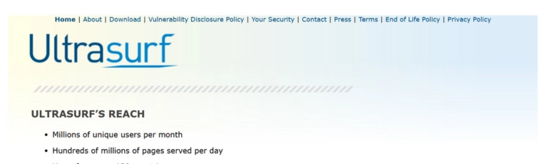
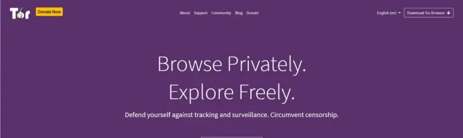
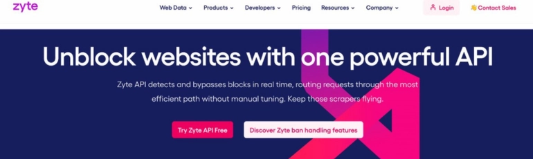

# Best Free Proxy Software: 28 Top Tools for Secure Anonymous Browsing in 2025

---

Tired of geo-blocks and privacy concerns? The internet can feel like a maze of restrictions—blocked content, tracked activity, and security risks lurking at every turn. That's where free proxy software steps in, acting as your digital cloak to access blocked sites while keeping your identity under wraps. But here's the catch: not all proxies are created equal. Some are sluggish, others leak your data, and many come with hidden costs that aren't so "free" after all.

This guide cuts through the noise. We've tested and compared 28 reliable free proxy tools—from browser-friendly options to enterprise-grade solutions—so you can find the perfect fit for your needs. Whether you're dodging censorship, scraping data for research, or just want to browse without leaving digital footprints, we've got you covered with honest reviews, speed comparisons, and security insights.

---

## What Exactly Is a Free Proxy?

A proxy acts as a middleman between you and the internet—think of it as a digital bodyguard that handles your web requests while hiding your real IP address. When you visit a website through a proxy, the site sees the proxy's location instead of yours. Pretty neat, right?

Here's a quick example: Say you're in a country where YouTube is blocked. Fire up a free proxy, and suddenly you're "browsing" from the Netherlands or the US—instant access. The proxy server sends your requests, receives the content, and passes it back to you. The website never knows your true location.

Free proxies are exactly what they sound like—proxy servers you can use without paying. Some offer unlimited bandwidth (with slower speeds), while others cap your usage but maintain decent performance. The tradeoff? You'll usually deal with ads, limited server locations, or basic encryption compared to premium options.

## Why Bother With Proxy Software?

Let's get real about why people actually use proxies:

**Your personal data stays yours.** Proxies mask your IP address and hide identifying information from websites. No more creepy targeted ads following you around because some site sold your browsing history. Your privacy? Protected.

**Filter out the garbage.** Good proxies act like bouncers at an exclusive club—blocking malicious sites, malware-infected pages, and sketchy content before they reach your device. It's like having a security guard for your internet connection.

**Speed things up (sometimes).** Proxies cache frequently accessed websites, storing temporary copies. Visit Reddit for the fifth time today? The proxy might serve a cached version instantly instead of fetching everything from scratch. Less waiting, more browsing.

**Bypass geographic restrictions.** Want to access content locked to specific regions? Proxies let you virtually "relocate" to different countries, unlocking region-specific content, news sites, or streaming services. Geography stops being a barrier.

The best part? These benefits come without complicated setup—most free proxies work right in your browser or with minimal configuration.

## The 28 Best Free Proxy Tools You Need to Know

Let's dive into the good stuff. We've organized these by use case so you can jump straight to what matters for you.

### 1. Ultrasurf

Ultrasurf wins points for being stupidly simple. No installation headaches—download, run, and you're connected. The interface looks like it was designed in 2005 (because it probably was), but that bare-bones approach means zero learning curve.

The real magic? Ultrasurf automatically handles proxy configuration, even in tricky network environments where manual setup would make you want to throw your laptop. It's particularly solid for accessing blocked news sites or social media in restricted regions.

**The catch:** You're stuck with their server locations (no choosing between 50 countries), and speeds can fluctuate. But for quick, hassle-free proxy access? Hard to beat.

### 2. kProxy

Over 1.5 million users trust kProxy—and for good reason. This veteran (operating since 2005) offers browser extensions for Chrome, Firefox, Edge, and even Android's Kiwi browser. Most competitors barely support two browsers.

What sets kProxy apart is the portable Firefox browser for Windows with kProxy pre-installed. Throw it on a USB drive, and you've got instant anonymous browsing on any Windows machine without installation. College library computer? Work laptop? You're covered.

The free tier gets you basic features, but expect occasional slowdowns during peak hours. 👉 [For more reliable data collection without geographic limits, ScraperAPI handles proxy rotation automatically](https://www.scraperapi.com/?fp_ref=coupons), perfect when you need consistent performance for research or monitoring.

### 3. Psiphon

Psiphon isn't messing around—it combines VPN, SSH, and HTTP proxy technologies into one tool designed specifically for bypassing censorship. The software automatically hunts for new access points, constantly adapting to defeat restrictions.

Choose between VPN mode (L2TP over IPSec), SSH, or SSH+ (which adds obfuscation to hide your proxy usage). The split-tunneling feature is clever—route international traffic through the proxy while local sites load normally. Why proxy everything when you only need it for specific content?

**Real talk:** Psiphon prioritizes access over security. It gets you past blocks brilliantly but doesn't provide robust privacy protection. Use it for accessing content, not for sensitive activities.

### 4. SafeIP

SafeIP focuses on hiding your IP address across multiple activities—web browsing, email, games, and other online services. The Pro version protects up to 5 devices simultaneously, making it solid for households or small teams.

While primarily a Windows tool, you can use your SafeIP credentials on Mac, Linux, mobile devices, or routers that support OpenVPN. It's more flexible than it first appears.

The free version works fine for casual browsing, but power users will want the Pro subscription for consistent speeds and device flexibility.

### 5. CyberGhost

CyberGhost brings serious firepower—over 6,100 servers across 88 countries. This Romanian-based VPN (now owned by Kape Technologies) specializes in streaming and torrenting with dedicated optimized servers.

**Why it matters:** Access Netflix content from multiple regions, download torrents safely, or bypass workplace restrictions—all from one platform. The apps work seamlessly across iOS, Android, macOS, Windows, Linux, Apple TV, Amazon Fire TV, and routers.

The encryption is military-grade (no exaggeration), and their no-logs policy means your activity stays private. Unlike bare-bones proxies, CyberGhost balances ease-of-use with genuine security features.

### 6. Tor

Tor (The Onion Router) is the gold standard for true anonymity. Originally developed by the US Navy, it's now maintained by the nonprofit Tor Project focused on privacy tools.

Tor routes your traffic through multiple volunteer-run servers worldwide, encrypting it at each hop. By the time your request reaches its destination, it's nearly impossible to trace back to you. Perfect for journalists, activists, or anyone needing serious privacy.

**The downside?** Speed. All that encryption and routing takes time—expect slower page loads. Tor also doesn't play nice with some websites that block known Tor exit nodes.

### 7. Freegate

Developed specifically for users in restrictive countries (China, North Korea, Syria, Iran, UAE), Freegate excels at defeating government censorship. It uses Dynamic Internet Technology's Dynaweb system to route traffic through constantly shifting proxy servers.

The software automatically finds working proxy servers, adapting as governments block access points. For users facing aggressive censorship, Freegate's persistence is invaluable—it keeps trying until it finds a way through.

Setup is zero-hassle, and it's completely free. The tool focuses exclusively on access rather than comprehensive privacy, so keep that in mind for sensitive activities.

### 8. Acrylic DNS Proxy

Acrylic DNS Proxy takes a different approach—instead of routing all your traffic, it optimizes DNS lookups to speed up browsing and block ads simultaneously.

Install it on Windows, and it caches DNS responses from your ISP's servers. Second time you visit Reddit? Instant load—no waiting for DNS resolution. The custom HOSTS file blocks hundreds of thousands of ad domains automatically.

**Technical perks:** Supports wildcards and regex in HOSTS files, simultaneous queries to multiple DNS servers, and sliding-expiry caching for always-fresh data. It's particularly effective for users who frequently revisit the same sites.

### 9. HideMyAss (HMA)

HMA started in 2005 in the UK and now operates under Avast's security umbrella. With over 1,000 servers across 190+ countries, it offers one of the most extensive geographic coverage options available.

The speeds are genuinely fast, making it suitable for streaming HD video or online gaming without noticeable lag. Security features include a kill switch (cuts internet if VPN drops), malware protection, and IP masking.

**Important note:** HMA doesn't work reliably in China due to the Great Firewall's sophistication. The free version also limits data usage and speeds—expect to upgrade for full performance.

### 10. Bright Data

Bright Data targets organizations and professionals needing serious data collection capabilities. This isn't your casual "unblock Netflix" proxy—it's built for web scraping at scale.

Choose from residential proxies, datacenter proxies, mobile proxies, or P2P 3G/4G networks depending on your scraping needs. The platform includes advanced analytics tools to extract insights from collected data.

Pricing runs $2-$10 per GB depending on proxy type and volume. It's expensive compared to consumer proxies, but the reliability and scale justify costs for businesses doing competitive intelligence or market research.

### 11. Smartproxy

Smartproxy serves marketers, security professionals, and enterprises with a network exceeding 40 million IPs across 195 countries. The variety is impressive—residential proxies, datacenter proxies, and dedicated datacenter options.

Unlimited concurrent connections mean you can run multiple scraping jobs simultaneously without throttling. The service supports IPv4, HTTP, mobile IPs, and desktop IPs for maximum compatibility with different applications.

**Security-focused:** Smartproxy uses data encryption and IP masking to protect your collection activities. Pricing ranges from $75-$400/month depending on bandwidth needs, with a 3-day free trial to test before committing.

### 12. Hide.me

Hide.me offers a secure free proxy tier with 2GB monthly data—decent for occasional use. The service supports IKEv2, OpenVPN, SoftEther, SOCKS, and SSTP protocols for broad device compatibility.

Dedicated torrent servers ensure fast P2P downloads without impacting other traffic. Browser extensions for Chrome and Firefox make enabling the proxy a single click.

Free users are limited to Netherlands servers. Need other locations or more data? The paid tier costs $19.95/month with access to their full server network.

### 13. Whoer

Whoer keeps things simple—a free proxy service with servers in the Netherlands and speeds up to 1 Mbps. Install browser extensions for Chrome, Opera, Firefox, or Yandex on desktop and mobile.

The extensions help access geo-restricted streaming content effortlessly. While speeds won't blow your mind, it's solid for basic browsing and accessing blocked sites.

**Limitation alert:** Free tier is Netherlands-only with capped speeds. Consider it a decent option for light usage, not data-intensive activities.

### 14. ProxySite

ProxySite offers web-based proxy access with SSL encryption—no software installation required. Just visit their site, enter a URL, and start browsing anonymously.

Supports popular sites like YouTube, Facebook, Reddit, Twitter, Google, and Imgur right out of the box. Servers in Europe and the US provide decent speeds for casual browsing.

It's completely free and requires zero setup. The web-based approach means it works on any device with a browser—including locked-down computers where you can't install software.

### 15. Hidester

Hidester provides free anonymous browsing with basic functionality. It excels at accessing blocked websites and hiding your IP from sites you visit.

**Important limitations:** No JavaScript support or form submission means online shopping, banking, or interactive sites won't work properly. Hidester is strictly for reading content on static or lightly interactive sites.

Think of it as a read-only proxy—perfect for accessing news articles, blogs, or basic research, but not suitable for full-featured web applications.

### 16. Megaproxy

Megaproxy brings premium features including anonymous access, SSL encryption, VPN Web SSL, and support for HTML, CSS, XHTML, JavaScript, and Flash/ActiveX.

Flexible cookie storage lets you save sessions from remote sites, speeding up return visits. FTP support and JavaScript compatibility set it apart from simpler proxies.

At $9.95 for three months, it's reasonably priced for the feature set—especially if you need those advanced capabilities like FTP access or full JavaScript support.

### 17. Oxylabs

Oxylabs targets enterprise clients with over 102 million IPs spanning 195 countries. The service provides both residential and datacenter proxies, plus e-commerce APIs and headless browsers.

Plans range from $99-$500/month depending on volume and features. This is overkill for personal use but essential for businesses doing large-scale competitive intelligence or price monitoring.

The API integration simplifies connecting proxy services to existing workflows and applications—developer-friendly with comprehensive documentation.

### 18. CroxyProxy

CroxyProxy supports HTTPS and SSL protocols with a Permalink feature for easy sharing. The free service hides your IP, supports HTML5 video playback, and works with social media sites.

Free version limitations include occasional ads and modest speeds. But for accessing blocked social media or streaming sites casually? It gets the job done without fuss.

No registration required—just visit the site and start browsing. The simplicity is its biggest selling point.

### 19. Hideoxy

Hideoxy provides basic IP hiding and encryption on both mobile and desktop devices. It works through your browser without installing dedicated apps.

The service bypasses geographic restrictions effectively. Free tier works in select countries only—check availability for your region before relying on it.

Encryption protects your data from attackers and malware. For quick anonymous browsing sessions, Hideoxy delivers adequately.

### 20. VPNBook

VPNBook offers genuinely free proxy and VPN access with 256-bit SSL encryption—military-grade security without paywalls. Servers in the US, UK, and Canada provide solid geographic coverage.

The free service includes most features you'd find in paid VPNs, making it excellent for budget-conscious users who still want strong privacy protection.

**No catches:** VPNBook is donation-supported but doesn't require payment. Expect reasonable speeds and reliability for a free service.

### 21. 4everproxy

4everproxy runs on VPN connections with servers in 9 countries and over 20 IP location options. UDP/TCP support enables stable connections to multiple devices and servers simultaneously.

Free version provides basic anonymity and access to blocked sites but limits bandwidth and speeds. Pro version ($3.95-$9.95/month) removes restrictions and adds unlimited bandwidth plus multi-device support.

The variety of server locations makes it suitable for accessing region-specific content from different countries.

### 22. Hotspot Shield

Hotspot Shield delivers premium VPN features including P2P encryption, SSL 256-bit security, and malware blocking across desktop, mobile, and Smart TVs.

Over 1,800 servers in 80 countries ensure fast, reliable connections globally. The free version caps bandwidth and speeds, while paid tiers ($7.99-$12.99/month) include OpenVPN support, router compatibility, and premium apps like 1Password and Robo Shield.

Strong security features make it suitable for sensitive browsing without compromising speed on paid plans.

### 23. NetNut

NetNut specializes in business data collection with 1 million static proxies and 20 million residential IPs. The datacenter proxy infrastructure scales to enterprise needs.

Anonymous data extraction keeps your scraping activities undetected. Pricing tiers accommodate different business sizes:
- Residential: $300-$4,000/month
- Static Residential: $350-$5,000/month  
- Data Center: $20-$500/month

7-day free trial lets you test performance before committing. The service prioritizes reliability and scale over consumer-friendly features.

### 24. Zyte

Zyte (formerly Scrapinghub) provides rotating proxies specifically designed for web scraping. The extensive proxy network spans multiple geographic locations for comprehensive data collection.

Plans range from basic ($29/month) for simple scraping to enterprise ($999+/month) for complex, high-volume operations. The 14-day free trial gives you full feature access to evaluate fit.

Advanced scraping tools and APIs make Zyte particularly developer-friendly for building automated data collection pipelines.

### 25. ScraperAPI

ScraperAPI simplifies proxy integration for developers through straightforward API calls. Combine IP rotation with JavaScript rendering for high-performance scraping.

Support for Node.js, PHP, Ruby, Python, Java, and Bash means integration into existing codebases is painless. Unlimited bandwidth with 40+ million IPs across 50+ locations ensures reliable data collection at scale.

👉 [ScraperAPI automates proxy rotation and handles CAPTCHAs automatically—test it free for 7 days to see how it streamlines web scraping](https://www.scraperapi.com/?fp_ref=coupons). Paid plans start at $29/month for hobby projects, scaling to custom enterprise pricing.

### 26. Proxy Scraper

Proxy Scraper maintains constantly updated lists of free HTTP, HTTPS, Socks4, and Socks5 proxies organized by country and type.

Browser extension makes managing proxy lists by country, protocol, and uptime simple. Adjustable timeout slider lets you balance speed versus reliability based on your needs.

Perfect for developers who need quick access to working proxies without maintaining their own infrastructure. The lists update regularly, ensuring you always have active proxies available.

### 27. ProxySale

ProxySale provides IPv4 and IPv6 proxies from Proxy-Sale CIS, used widely in SMM, SEO, affiliate marketing, and entertainment industries.

Anonymous browsing with no activity logs keeps your scraping and automation secure. Over 50 IP addresses including US and EU locations offer solid geographic coverage.

24/7/365 customer support helps troubleshoot issues quickly. Unlimited bandwidth and 11 helper tools (Proxy Checker, Port Scanner, etc.) optimize your proxy usage.

Pricing starts at $0.80/week for IPv4 proxies and $0.69/week for 10 IPv6 proxies—affordable for testing before scaling up.

### 28. GeoSurf

GeoSurf targets developers and IT professionals needing advanced data collection. Unlimited proxy and IP collection without blocks makes large-scale scraping reliable.

Network includes 2.5+ million IPs across 1,700+ global locations. Built-in bots scrape websites anonymously and efficiently.

Plans scale from starter ($450/month) to enterprise (custom pricing). The extensive infrastructure and advanced features justify the premium pricing for serious data collection projects.

---

## Making the Right Choice

Choosing proxy software depends entirely on what you need:

**Casual browsing and accessing blocked sites?** Ultrasurf, ProxySite, or Hidester provide simple, free solutions without complexity.

**Serious privacy and security?** Tor, CyberGhost, or Hide.me offer robust encryption and comprehensive protection.

**Web scraping and data collection?** ScraperAPI, Bright Data, or Zyte deliver the reliability and scale professional projects require—rotating IPs automatically and handling anti-scraping measures so you can focus on analyzing data instead of maintaining infrastructure.

**Enterprise needs?** Oxylabs, NetNut, or GeoSurf provide the infrastructure and support large organizations demand.

The free options work brilliantly for light usage, but don't expect enterprise-grade performance. If you're building a business around data collection or need consistent speeds, paid services deliver value that justifies their cost.

Test several options—most offer free trials—and see what fits your workflow. The "best" proxy is the one that actually solves your specific problem without creating new headaches.
